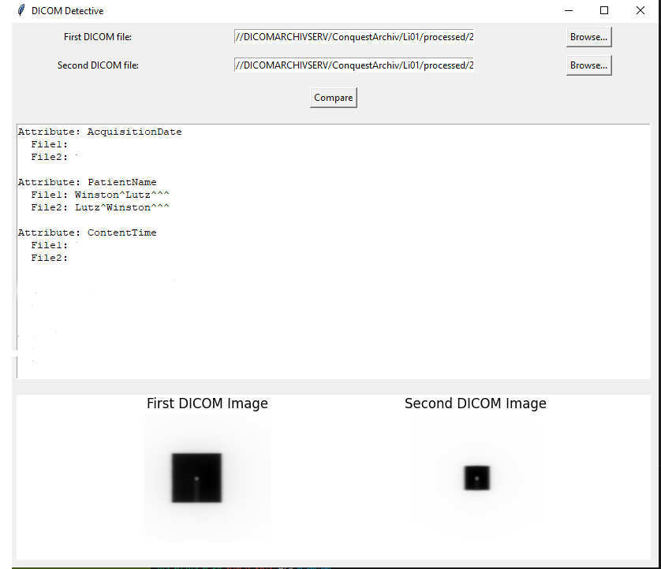

# DICOM Detective

DICOM Detective is a Python-based GUI application for comparing DICOM files. It allows users to select two DICOM files and compare all their tags, displaying the differences in an easy-to-read format. The application also plots the DICOM images side by side for visual comparison.

## Features

- Compare all tags of two DICOM files (excluding `PixelData` for efficiency)
- User-friendly GUI for selecting files
- Display differences in a text format
- Plot DICOM images side by side for visual comparison
- Supports any DICOM files

## Requirements

- Python 3.x
- `pydicom` library
- `matplotlib` library
- `tkinter` library (comes with standard Python installation)
- `python-gdcm` library
- `pylibjpeg` and its plugins

## Installation

1. Clone the repository:

    ```sh
    git clone https://github.com/ES-92/dicom-detective.git
    cd dicom-detective
    ```

2. Install the required libraries:

    ```sh
    pip install pydicom matplotlib python-gdcm pylibjpeg pylibjpeg-libjpeg pylibjpeg-openjpeg
    ```

## Usage

1. Run the application:

    ```sh
    python dicom_detective.py
    ```

2. Use the GUI to select the two DICOM files you want to compare.
3. Click the "Compare" button to see the differences.
4. The DICOM images will be plotted side by side in the GUI.

## Example



## Contributing

1. Fork the repository.
2. Create a new branch (`git checkout -b feature-branch`).
3. Make your changes.
4. Commit your changes (`git commit -m 'Add new feature'`).
5. Push to the branch (`git push origin feature-branch`).
6. Create a new Pull Request.

## License

This project is licensed under the MIT License - see the [LICENSE](LICENSE) file for details.
